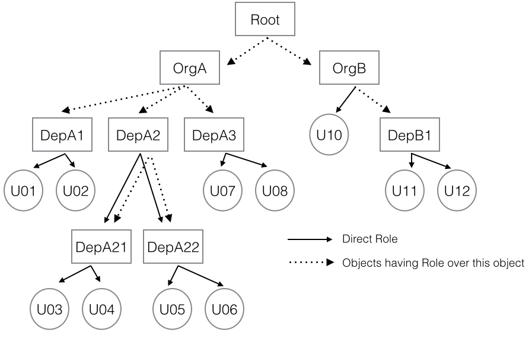
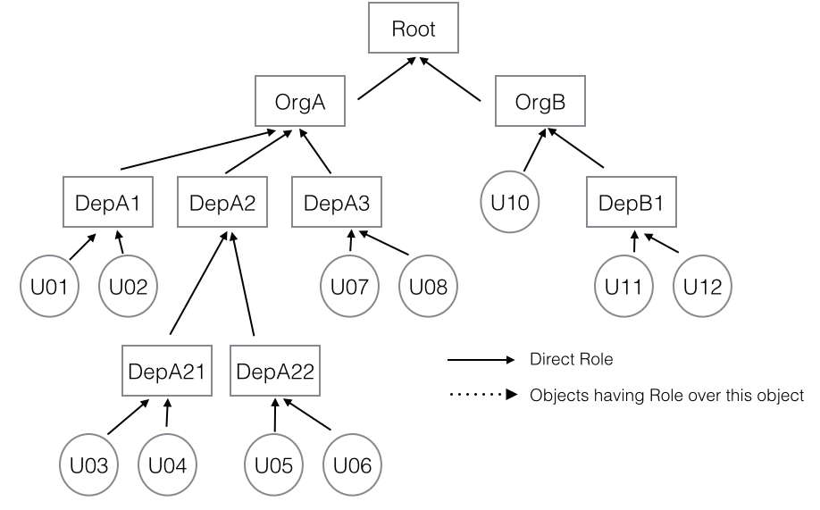

# Introduction

NkROLE is a framework for managing complex relations among arbitrary objects in an Erlang cluster. You can create any number of generic objects and define relations among them, based on _roles_. Any object can _have_ any _role_ over any other object. Also, you can define that all objects having a specific role over an object have automatically the same or other role over another object, and this complex relations can be nested at any level.

NkROLE creates a number of caches, so that, once all objects having a role over another object are found, the list is saved for future queries. If any of the base conditions used for the calculation change (because the base object or any of the objects used for the calculation have changed) all related caches are automatically invalidated (but only the related caches).

NkROLE creates a process for each used object in the cluster called the _object proxy_. Object proxies have a timeout value. If no further query is received for a period of time, they are removed.

By default, all processes are created at the caller node, but they can be spread in the cluster implementing the [nkrole_backend](src/nkrole_backend.erl) behaviour. NkROLE is designed to fit well with [NkDIST](https://github.com/Nekso/nkdist), distributing the load evenly on a _riak_core_ cluster. 

For each query that involves nested roles, a cache (another Erlang process) is started for each specific role at each related proxy, also with an specific timeout value, so that new queries are very fast, even with a huge number of objects and nested relations.

NkROLE can use any external backend for the object storage, implementing the [nkrole_backend](src/nkrole_backend.erl) behaviour and using the `backend` configuration value. An ETS based backend is included by default.

# Example1

Let's say we want to model a _member_ relationship, following this schema:


We want to say that:

* _Members_ of object `root` are all objects being _members_ of `orgA` or `orgB`.
* _Members_ of `orgA` are all objects members of `depA1`, `depA2` or `depA3`.
* _Member_ of `depA1` are `u01` and `u02`.
* _Members_ of `depA2` are `depA21`, `depA22` and also all object being members of thouse objects.
* ... and so on.

We can create this structure:
```
$ make shell
```

```erlang
> nkrole_backend:put_roles(root, #{member=>[{member, orgA}, {member, orgB}]}).
ok

> nkrole_backend:put_roles(orgA, #{member=>[{member, depA1}, {member, depA2}, {member, depA3}]}).
ok

> nkrole_backend:put_roles(orgB, #{member=>[u10, {member, depB1}]}).
ok
```

and so on, or you could first create the objects and then apply the roles:
```erlang
> nkrole_backend:put_roles(root, #{}).
ok

> nkrole:add_subrole(member, root, member, orgA, #{}).
ok
```

This particular structure happens to be used at the tests, so you can create all at once:

```
$ make build_tests
$ make shell
```

```erlang
> test_util:insert(set1).
ok
```

Now we can query in many ways:
```erlang
> % Get direct roles
> nkrole:get_role_objs(member, orgB, #{}).
{ok, [u10, {member, depB1}]}

> % Get nested roles
> nkrole:find_role_objs(member, orgB, #{}).
{ok, [u10, u11, 12]}

> nkrole:find_role_objs(member, root, #{}).
{ok,[u01,u02,depA21,depA22,u03,u04,u05,u06,u07,u08,u10,u11,u12]}.

> % Check users
> nkrole:has_role(u03, member, depA21, #{}).
{ok, true}

> nkrole:has_role(u03, member, depB1, #{}).
{ok, false}

> nkrole:has_role(u03, member, root, #{}).
{ok, true}
```


# Example2

The previous test data adds also another role called `head` to the same schema:



We want to say that all users report to their department (except `u10`), departments to their organizations, and organizations to root:

```
$ make build_tests
$ make shell
```

```erlang
> test_util:insert(set1).
ok
```

Now we can query:
```erlang
> nkrole:get_role_objs(head, u05, #{}).
{ok,[depA22,{head,depA22}]}

> nkrole:find_role_objs(head, u05, #{}).
{ok,[depA22, depA2, orgA, root]}
```

This second example is very similar to the case for nested configuration, where an object is configured based on one or more _parents_.


# Using custom backends

Instead of the included ETS backend, you can define your own storage. You must create a module implementing the [nkrole_backend](src/nkrole_backend.erl) behaviour, defining `get_roles/1` and `put_roles/2` and pointing the `backend` configuration directive to your module.

Remeber to stop all caches for an object after it is modified on storage, calling `nkrole:stop/1`. If you only modify some roles calling `nkrole:add_role/4`, `nkrole:add_subrole/5`, `nkrole:del_role/4` or `nkrole:del_subrole/5` you don't need to delete the cache. The invalid caches will be automatically deleted.


# Using a custom distribution mechanism

You can also take the responsability for locating and starting object processes, for example to distribute them in the cluster using [NkDIST](https://github.com/Nekso/nkdist). You must implement the same callback module as for storage, and implement `get_proxy/2`.


# Configuration

NkROLE uses standard Erlang application environment variables. The same Erlang application is used for agents and controllers. 

Option|Type|Default|Desc
---|---|---|---
backend|`ets|atom()`|`ets`|Backend to use, implementing the nkrole_backend behaviour
proxy_timeout|`pos_integer()`|`180000`|Timeout for proxy objects
cache_timeout|`pos_integer()`|`180000`|Timeout for cache objects
